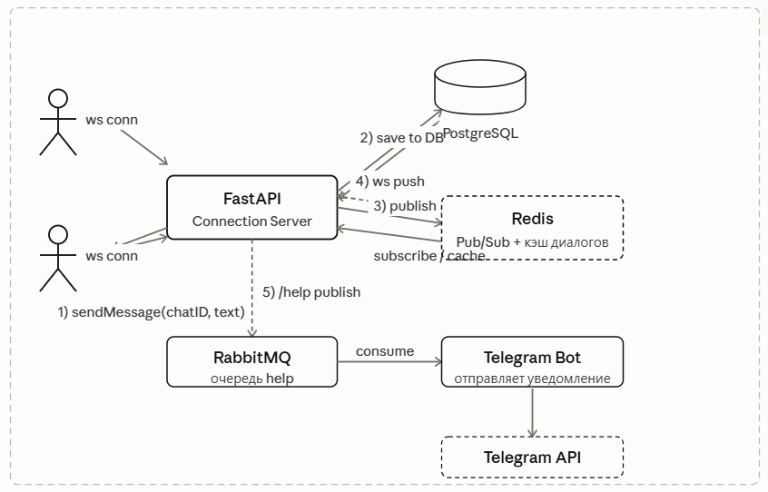

# Эмулятор мессенджера с регистрацией без привязки к данным + связь с телеграмм ботом

идея заключалась в создании +- анонимного мессенджера, в котором не нужно вводить ничего

## основной функционал на данный момент:
    -Регистрация
    -Авторизация
    -Личные беседы с пользователями
    -Групповые беседы с пользователями
    -Отправка видео, аудио, фото, документов, а также обычных текстовых сообщений
    -Отправка через rabbitmq сообщения в телеграмм бота для обращения в поддержку

## плюсы
    - анонимность
    - нет привязки к данным
    - защита от слежки
    - создание одноразовых аккаунтов
## минусы
    - невозможно сделать двухфакторную аутентификацию
    - невозможность восстановить аккаунт
    - пониженное доверие в переписке

## установка
    git clone https://github.com/levvis16/levi_app
    
    docker compose up --build

# Основной стек технологий:

### FastAPI, PostgreSQL, RabbitMq, Redis, JWT-authentication, Alembic, SqlAlchemy, Pydantic, Uvicorn,  Asyncpg, bcrypt

## планы на будущее:
    -расширение возможностей админа
    -доработки по фронту: отображать онлайн ли пользователь, возможность ответа на сообщение, удаление сообщения
    -возможность отправлять файлы и видео
    -добавить кафку для работы с консьюмерами

# UML-Диаграмма взаимодействия

